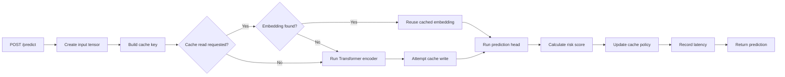
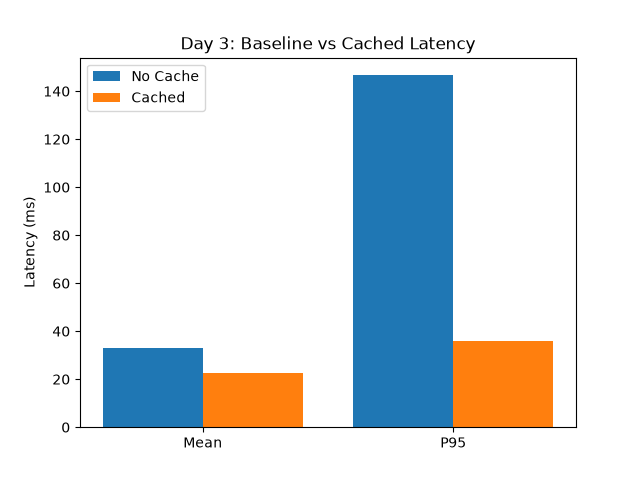

# Inference Hub

Inference Hub is an experimental inference service built to study one practical question:

> Can reusable model embeddings reduce inference latency without introducing unacceptable correctness risk?

The project combines a small Transformer-based model, an in-memory embedding cache, a policy that can disable caching, and a set of latency experiments. It is intended as a systems prototype for reasoning about the trade-off between speed and correctness—not as a trained prediction product or production-ready serving platform.

## The problem being explored

Model inference often repeats work. If multiple requests contain the same reusable input region, the service may be able to cache an intermediate model representation and skip part of the computation on later requests.

That creates two competing goals:

- **Performance:** reduce repeated computation and improve latency, especially p95 and p99 tail latency.
- **Correctness:** avoid reusing an embedding when the underlying input has changed enough that the cached representation is no longer valid.

Inference Hub currently makes the performance side observable by recording latency and cache behavior. It also applies a simple internal risk policy, but the risk score is not returned or stored as a metric. The separate correctness experiment now runs as a standalone drift measurement, but it is not integrated with API cache decisions.

## System design

The model expects a sequence in which each row contains 32 numeric features. A request moves through the following pipeline:



### Model

The PyTorch model has two stages:

1. A Transformer encoder converts the input sequence into a pooled 96-dimensional embedding.
2. A prediction head converts that embedding into 32 sigmoid outputs.

The API returns the mean of those 32 outputs as a single prediction.

The model is randomly initialized and has no trained checkpoint. Its purpose is to provide nontrivial inference computation for cache and latency experiments. The prediction itself has no domain meaning and normally changes when a new process creates a new randomly initialized model.

### Embedding cache

The active cache reads `CACHE_MAX_SIZE`, `CACHE_TTL_SECONDS`, and `CACHE_ENABLED` from `app/config.py`. Without environment overrides, it uses:

- Maximum size: 256 entries
- TTL: 30 seconds from the most recent insertion or update
- LRU eviction when capacity is exceeded
- Current size plus hit, miss, expiration, and eviction counters
- Hit rate as a decimal ratio rounded to three places

Expiration is lazy: an expired entry is removed only when that key is read. Cache reads attempted while the cache is globally disabled are counted as misses.

The current cache key is a SHA-256 hash of the Python string representation of the first four **sequence rows**. This distinction matters: the key does not use the first four scalar features.

The benchmark sends one-row sequences, so its key represents the complete input row. For longer sequences, two inputs with identical first four rows but different later rows receive the same key even though the cached embedding represents the full sequence. That is a known correctness risk in the current prototype.

### Cache-control policy

After inference, the service calculates:

```text
expected_norm = sqrt(embedding_dimension)
risk_score = abs(embedding_norm - expected_norm) / expected_norm
```

If the score is greater than `0.8`, caching is disabled globally for following requests. Otherwise, caching is reset to the configured `CACHE_ENABLED` value.

Because the 96-dimensional embedding is passed through `LayerNorm`, its norm is typically close to `sqrt(96)`. The resulting risk score is therefore usually near zero, which means this policy generally leaves caching at its configured value for normal embeddings.

This score is an embedding-norm deviation heuristic; it does not measure prediction error or embedding drift. It is useful as a demonstration of policy-controlled infrastructure, but the threshold is not calibrated well enough for a meaningful cache-performance comparison yet.

## What is measured

The project records two different views of latency.

### Service latency

`POST /predict` measures time inside the API handler. This includes:

- Tensor creation
- Cache lookup
- Model embedding computation on a miss
- Prediction-head computation
- Risk evaluation

The service stores these measurements in memory and exposes:

- **p50, p95, and p99:** index-based order-statistic approximations from the sorted latency list
- **count:** number of recorded requests

The service implementation does not interpolate percentiles. For example, with 100 measurements it returns sorted-list elements 51, 96, and 100 for p50, p95, and p99 respectively. Its p50 is therefore not always the mathematical median.

### Client-observed latency

`experiments/load_test.py` measures elapsed time around the complete HTTP request. It therefore includes service execution plus local HTTP and scheduling overhead.

The experiment report contains:

- Mean latency
- Median latency, stored as `p50`
- p95 and p99 estimates from Python's `statistics.quantiles`
- Request count

### Cache metrics

`GET /stats` reports:

- Cache hits and misses
- Current cache size
- Expired entries
- LRU evictions
- Hit rate as a decimal ratio rounded to three places
- Whether the policy currently allows cache use

These metrics are process-local and reset whenever the service restarts.

## Experiment design

The current load test runs three workloads against `POST /predict`:

| Workload | Requests | Concurrency | Input | Cache-read flag |
|---|---:|---:|---|---|
| Baseline | 100 | 10 | Identical one-row sequence | Disabled |
| Cached-prefix reuse | 100 | 10 | Identical one-row sequence | Enabled |
| Larger cached workload | 250 | 50 | Identical one-row sequence | Enabled |

The third workload is named `bursty_cached` in the report and increases both request count and concurrency.

`use_cache=false` bypasses both cache reads and writes, providing a strict no-cache baseline.

## Recorded latency results

The generated `reports/day3_results.json` currently present in this workspace contains:

| Workload | Mean | p50 | p95 | p99 |
|---|---:|---:|---:|---:|
| Baseline, 100 requests | 32.82 ms | 20.55 ms | 146.66 ms | 152.02 ms |
| Cached-prefix reuse, 100 requests | 22.49 ms | 21.27 ms | 35.97 ms | 38.46 ms |
| Larger cached workload, 250 requests | 21.35 ms | 20.90 ms | 25.79 ms | 36.17 ms |

The JSON report is ignored by Git, so it is a local generated artifact rather than a file included in a fresh clone. The comparison chart shown below is tracked in the repository.

Relative to the recorded baseline, the cached-prefix run shows:

- 31.5% lower mean latency
- 3.5% higher p50 latency
- 75.5% lower p95 latency
- 74.7% lower p99 latency



### How to interpret these results

The lower mean and tail measurements are observations from one local run. They cannot currently be attributed confidently to cache reuse.

The active risk policy usually leaves caching at its configured value for normal embeddings, but the load test does not record whether each request was a cache hit. First-forward or kernel warm-up, Python scheduling, and machine load can therefore explain part or all of the difference.

A defensible cache benchmark should:

1. Use a calibrated or temporarily fixed cache policy.
2. Clear and reset service state before every workload.
3. Make the baseline bypass both cache reads and writes.
4. Record cache-hit status for every request.
5. Run multiple trials and report variation or confidence intervals.
6. Separate warm-up requests from measured requests.
7. Test both exact input reuse and safe prefix reuse.

The current results demonstrate the measurement pipeline, but they should not be treated as a final performance claim.

## Correctness and drift work

The repository includes an early correctness experiment intended to:

1. Generate features that drift over time.
2. Compare a cached embedding with a freshly computed embedding.
3. Measure cosine and L2 distance.
4. Treat embedding divergence as correctness risk.

That is the intended bridge between cache performance and cache safety. `experiments/correctness_experiment.py` now imports `InferenceModel` and calls `get_embedding()`, so it can run as a standalone drift probe. It still does not drive API cache decisions or validate a production correctness threshold.

## API surface

The service exposes three endpoints:

| Endpoint | Purpose |
|---|---|
| `POST /predict` | Run inference, optionally attempt cache reuse, and return prediction latency |
| `GET /stats` | Inspect cache counters and latency percentiles |
| `GET /health` | Check service health and whether caching is currently enabled |

A prediction request has this shape:

```json
{
  "data": [[1, 1, 1, 1, 0, 0, 0, 0, 0, 0, 0, 0, 0, 0, 0, 0, 0, 0, 0, 0, 0, 0, 0, 0, 0, 0, 0, 0, 0, 0, 0, 0]],
  "use_cache": true
}
```

Each inner row must contain 32 values. The current schema does not validate that width before model execution.

The response has the following shape; the numeric values below are illustrative:

```json
{
  "prediction": 0.5,
  "cache_hit": false,
  "latency_ms": 12.34
}
```

## Repository map

```text
app/
  main.py       Request flow, cache lookup, active policy, and API routes
  model.py      Transformer encoder and prediction head
  cache.py      In-memory LRU and TTL cache
  tracker.py    In-process latency percentile tracking
  schemas.py    API request and response models
  config.py     Environment-backed cache settings

agent/
  policy.py     Standalone policy prototype
  controller.py Standalone cache controller prototype

experiments/
  load_test.py               HTTP latency benchmark
  plot_day3.py               Latency chart generation
  drift_sim.py               Synthetic feature drift
  correctness.py             Embedding-distance functions
  correctness_experiment.py  Standalone correctness and drift experiment

reports/
  day3_results.json              Generated benchmark data (gitignored)
  day3_latency_comparison.png    Tracked sample chart
```

The standalone files in `agent/` are not used by the API. The policy and controller use the same decisions: `NORMAL`, `SHORT_TTL`, and `DISABLE_CACHE`.

`app/main.py` consumes `CACHE_MAX_SIZE`, `CACHE_TTL_SECONDS`, and `CACHE_ENABLED` from `app/config.py`, so those runtime settings can be overridden through the environment. `PREFIX_K` is declared in `app/config.py` and Docker Compose, but `make_cache_key()` still uses its function default of `4`.

## Reproducing the experiment

The service can be started with:

```bash
docker compose -f docker/docker-compose.yml up --build
```

With the API running on port `8000`, generate the measurements and chart with:

```bash
python experiments/load_test.py
python experiments/plot_day3.py
```

The load test requires `httpx`. Plotting additionally requires `matplotlib`; the drift helper requires `numpy`. The latter two are not currently declared in `requirements.txt`.

## Project status

Inference Hub currently implements the main path of a cache-aware inference experiment:

- The API can compute, cache, and reuse pooled model embeddings when the request asks for a cache read and the global policy permits access.
- Cache behavior and latency can be observed through one service.
- A policy can change serving behavior based on a risk signal.
- The repository contains drift and embedding-distance helpers, and the standalone correctness experiment can measure embedding divergence over generated drift.

The next engineering step is to make the experiment scientifically valid: fix cache semantics, calibrate the policy, isolate benchmark runs, and connect cache decisions to measured embedding drift.

## License

No license file is included yet.
